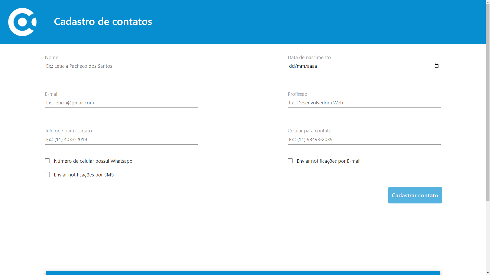

# Alphacode - Teste



---

## Sobre

Este projeto representa uma avaliação destinada a testar os conhecimentos para uma oportunidade de emprego na empresa Alphacode.

---

## Tecnologias utilizadas

- PHP
- HTML
- CSS
- JavaScript
- JQuery 
- MySQL
- Bootstrap
- XAMPP
- Postman
- Composer

---

## Banco de dados

A seguir, está o script utilizado para a criação do banco de dados:

```sql

create database db_alphacode;

use db_alphacode;

create table tbl_contatos (
       id int not null auto_increment primary key,
       nome varchar(150) not null,
       data_nascimento date not null,
       email varchar(255) not null,
       profissao varchar(100) not null,
       telefone varchar(20) not null,
       celular varchar(20) not null,
       numero_whatsapp boolean not null,
       notificacao_email boolean not null,
       notificacao_sms boolean not null
);

```

---

## Como rodar a aplicação

- 1º Baixe o PHP, XAMPP e o Composer.
- 2º Depois de baixar todos eles, realize a configuração individual de cada um.
- 3º Após ter configurado o XAMPP, abra o seu explorador de arquivos e procure pelo diretório 'xampp'. Siga esse caminho: xampp > htdocs e cole o clone deste projeto nessa pasta.
- 4º Abra esse projeto no seu editor de texto e siga esse caminho: backend > src > model > conexao.php e mude o valor das variáveis abaixo de acordo com seu banco de dados.

```javascript

const SERVER = 'localhost';
const USER = 'root';
const PASSWORD = '78321875';
const DATABASE = 'db_alphacode';

```

- 5º Abra o XAMPP e inicie o Apache.
- 6º Retorne a pasta deste projeto e siga esse caminho: frontend > e rode o index.html com o Live Server.

[Clique aqui](https://drive.google.com/file/d/1HMIG9B1wthFrjMwazmuyz0EI85urmYUA/view?usp=sharing) para assistir a um breve vídeo explicativo sobre como realizar todas essas etapas.

---


## Aplicação funcionando

[Clique aqui](https://drive.google.com/file/d/1MQIM-LZtLToh7V5GBUgi1rksxKaV_647/view?usp=sharing) para assistir a aplicação funcionando.